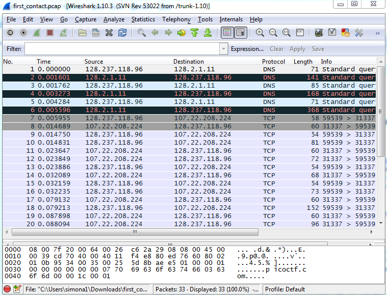

# Wireshark Part 2: First Contact
In this lab, we’ll solve one of the puzzles from the 2013 Toaster Wars high school hacking competition. The background story is that a robot has crashed in your backyard, and you need to hack into it to discover why it’s there. For this problem, we’ve discovered that the robot is communicating wirelessly with a space ship and we’ve captured the packets that were sent back and forth. The captured packets are in the file [first_contact.pcap](first_contact.pcap) . Your goal is to find the location of the ship by inspecting the network traffic.

1.	*Right Click* on the link [first_contact.pcap](first_contact.pcap) and choose *Save As* to download the file.
2.	Start wireshark by going to the start menu and choose *All programs | wireshark*. 
3.	Choose *File | Open*
4.	Browse to the folder where you downloaded [first_contact.pcap](first_contact.pcap) and open it. You should see something similar to the picture below   
   
5.	Look through the packets for clues about the location. When you discover the location, [google it](http://www.google.com).
6.	It’s a famous place. If you think you found it, write down the name of the famous place and call your instructor over to check your answer.

